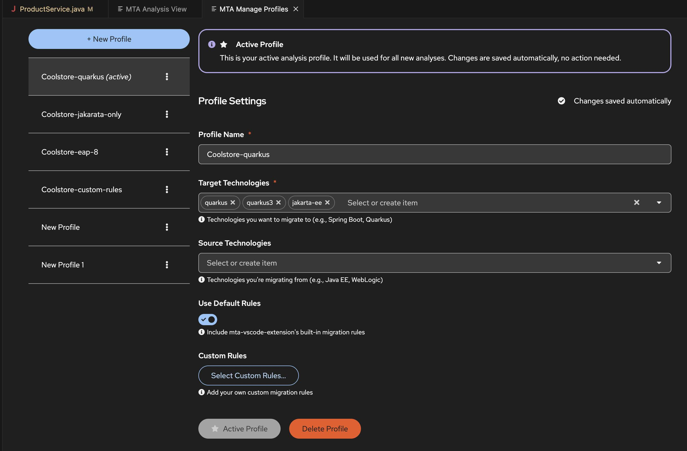

# Red Hat Migration Toolkit for Applications (MTA) - Getting started demo project

[](https://openjdk.java.net/)
[](https://maven.apache.org/)
[](https://github.com/sshaaf/migtools-getting-started/actions/workflows/maven.yml)

> **Comprehensive demonstration project showcasing the power of Red Hat Migration Toolkit for Applications (MTA) for enterprise application modernization**

This repository contains a collection of **real-world migration scenarios** designed to demonstrate how the **Red Hat Migration Toolkit for Applications (MTA)** can automatically detect, analyze, and provide guidance for modernizing enterprise applications across different technology stacks.

## **Project Overview**

The **MTA Demo Project** provides hands-on examples of common enterprise migration challenges, including:

- ** Platform Migrations** - Moving between different runtime environments
- ** Framework Upgrades** - Modernizing to newer versions of popular frameworks
- ** Language Migrations** - Upgrading Java versions and handling API changes
- ** Architecture Modernization** - Transitioning from monoliths to microservices
- ** Security Updates** - Updating deprecated security patterns and APIs

Each module represents a **complete, example application** with intentionally deprecated patterns that MTA can detect and provide migration guidance for.


## 📋 **Migration Scenarios**

| Module | Migration Path | Description | Key Technologies | Migration Issues |
|--------|---------------|-------------|------------------|------------------|
| **[coolstore](./coolstore/)** | **Java EE 7 → Jakarta EE** | E-commerce monolith application demonstrating Java EE to Jakarta EE migration patterns | Java EE 7, JBoss EAP, Angular, PostgreSQL | `javax.*` → `jakarta.*`, EJB patterns, JPA migrations |
| **[fuse2camel](./fuse2camel/)** | **Red Hat Fuse 7.3 → Apache Camel 4** | Integration application showcasing Camel 2.23 to Camel 4 migration scenarios | Apache Camel 2.23, Red Hat Fuse, Spring Boot | Deprecated Camel components, API changes, configuration updates |
| **[openjdk8-migration](./openjdk8-migration/)** | **OpenJDK 8 → OpenJDK 21** | Comprehensive examples of JDK 8 APIs requiring migration to JDK 21 | OpenJDK 8, Legacy APIs, Security Manager | Removed APIs, deprecated security patterns, module system changes |
| **[springboot2-migration](./springboot2-migration/)** | **Spring Boot 2 → Spring Boot 3** | Enterprise web application demonstrating Spring Boot 2 to 3 migration challenges | Spring Boot 2.7, Spring Security 5, Netflix OSS | `javax.*` → `jakarta.*`, deprecated Spring patterns, Netflix OSS removal |
| **[hotrod-repair](./hotrod-repair/)** | **JBoss EAP 7 → EAP 8** | Car repair shop management system showcasing EAP 7 to EAP 8 migration patterns | JBoss EAP 7, Java EE 7, JSP, PostgreSQL | Jakarta EE transition, servlet API changes, EJB updates |
| **[spring-framework-migration](./spring-framework-migration/)** | **Spring Framework 5 → Spring Framework 6** | User management system demonstrating Spring Framework 5 to 6 migration scenarios | Spring Framework 5, Spring Security 5, JPA | `WebMvcConfigurerAdapter`, security configuration, `javax.*` → `jakarta.*` |

##  **Project Structure**

```
mta-demo-project/
├── 📁 coolstore/                     # Java EE 7 → Jakarta EE migration
├── 📁 fuse2camel/                    # Red Hat Fuse → Apache Camel 4 migration  
├── 📁 openjdk8-migration/            # OpenJDK 8 → OpenJDK 21 migration
├── 📁 springboot2-migration/         # Spring Boot 2 → Spring Boot 3 migration
├── 📁 hotrod-repair/                 # JBoss EAP 7 → EAP 8 migration
├── 📁 spring-framework-migration/    # Spring Framework 5 → 6 migration
├── 📁 .github/                       # CI/CD workflows and automation
├── 📄 pom.xml                        # Parent Maven configuration
├── 📄 README.md                      # This file
```

## **Getting Started**

### **Prerequisites**

Before you begin, ensure you have the following installed:

- **☕ Java Development Kit (JDK)**:
  - **JDK 8+** for most modules
  - **JDK 17+** recommended for modern development
  - **JDK 21** for testing OpenJDK migration scenarios

- ** Apache Maven**: 3.6.0 or higher
- ** Docker** (optional): For running database services
- ** Git**: For cloning and version control


 Developer Lightspeed is part of the MTA extension installed in VSCode. Once the installation is done, click the MTA extension link for setup/configuration.

To use Developer Lightspeed. You will need access to an LLM. To use it with OpenShift using MaaS following `Gen-AI configuration should work`
```
  OpenShift:
    environment:
      OPENAI_API_KEY: "ed4f9f076eb480926b654be632d8bc3f" # Required
    provider: ChatOpenAI
    args:
      model: llama-4-scout-17b-16e-w4a16 # Required
      configuration:
        baseURL: "https://llama-4-scout-17b-16e-w4a16-maas-apicast-production.apps.xx.com:443/v1"
```

Next you should configure a Modernization profile with targets. For example



### **Module-Specific Build Requirements**

| Module | Java Version | Special Requirements | Build Command |
|--------|-------------|---------------------|---------------|
| **coolstore** | JDK 8+ | PostgreSQL (via Docker) | `mvn clean package` |
| **fuse2camel** | JDK 8+ | None | `mvn clean package` |
| **openjdk8-migration** | JDK 8 or JDK 21 | Profile-based compilation | `mvn clean compile -P jdk8-build` |
| **springboot2-migration** | JDK 8+ | PostgreSQL, Redis (via Docker) | `mvn clean package` |
| **hotrod-repair** | JDK 8+ | PostgreSQL (via Docker) | `mvn clean package` |
| **spring-framework-migration** | JDK 8+ | H2 Database (embedded) | `mvn clean package` |

## 🔬 **Using with Migration Toolkit for Applications (MTA)**

### **Analysis Workflow**

1. **Install MTA CLI or Web Console**
   - [MTA CLI Installation Guide](https://access.redhat.com/documentation/en-us/migration_toolkit_for_applications/)
   - [MTA Web Console Setup](https://developers.redhat.com/products/mta/overview)

2. **Run Analysis on Individual Modules**
   ```bash
   # Analyze Spring Boot migration
   mta-cli --input springboot2-migration/ --target spring-boot-3 --output reports/springboot2-analysis
   
   # Analyze Java EE to Jakarta EE migration
   mta-cli --input coolstore/ --target jakarta-ee --output reports/coolstore-analysis
   
   # Analyze OpenJDK migration
   mta-cli --input openjdk8-migration/ --target openjdk21 --output reports/openjdk-analysis
   ```

3. **Review Migration Reports**
   - Open generated HTML reports in `reports/` directory
   - Review identified migration issues and recommendations
   - Use provided code examples and migration guidance

### **Expected Analysis Results**

Each module is designed to trigger specific migration rules


## **Contribution Guidelines**

1. ** Fork the Repository**
   ```bash
   git fork https://github.com:migtools/getting-started.git
   ```

2. ** Create a Feature Branch**
   ```bash
   git checkout -b feature/new-migration-scenario
   ```

3. ** Follow Coding Standards**
   - no `System.out.println`
   - Include **comprehensive deprecated API usage**
   - Add **detailed comments** explaining migration issues
   - Follow existing **package naming conventions**: `com.redhat.mta.examples.*`

4. ** Test Your Changes**
   ```bash
   # Verify compilation
   mvn clean compile
   
   # Run tests
   mvn test
   
   # Verify MTA analysis triggers expected issues
   mta-cli --input your-module/ --target your-target --output test-analysis/
   ```

5. ** Create Pull Requests**
   - Provide **clear description** of migration scenario
   - Include **before/after examples** in PR description
   - Update **module table** in this README
   - Add **module-specific README** with detailed documentation

### **Adding New Migration Scenarios**

When adding new migration scenarios:

1. **Create Module Structure**
   ```bash
   mkdir new-migration-module
   cd new-migration-module
   # Follow existing module patterns
   ```

2. **Required Files**
   - `pom.xml` - Maven configuration with deprecated dependencies
   - `README.md` - Comprehensive module documentation
   - `src/main/java/` - deprecated code examples
   - `docker-compose.yml` - If database/external services required

3. **Update Parent POM**
   ```xml
   <modules>
       <!-- existing modules -->
       <module>new-migration-module</module>
   </modules>
   ```

4. **Update Main README**
   - Add row to migration scenarios table
   - Update build requirements if needed

## 🎉 **Acknowledgments**

- **Red Hat Migration Toolkit for Applications Team** - For providing the migration analysis framework
- **Konveyor Community** - For open source migration tooling
- **Contributors** - Thank you to all who have contributed migration scenarios and improvements

---

**Ready to modernize your enterprise applications?** Start exploring the migration scenarios and see how **Red Hat Migration Toolkit for Applications** can accelerate your application modernization journey! 🚀
