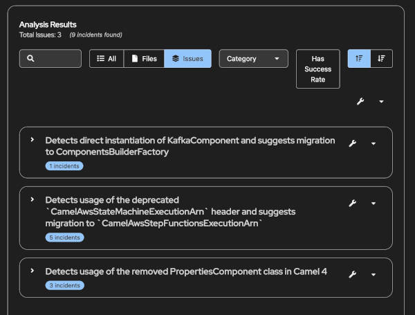

# 🚀 Fuse to Camel 4 Migration Demo

> **Showcase the power of Konveyor.io AI-powered static code analysis for seamless enterprise migration**

This project demonstrates how [Konveyor.io](https://konveyor.io/) (KAI) can automatically detect and provide migration guidance for upgrading from **Red Hat Fuse 7.3** (based on Apache Camel 2.23) to **Apache Camel 4**. It's a perfect example of how AI-powered static analysis can simplify complex enterprise migrations.

## 🎯 What This Demo Shows

- **Real-world migration scenarios** with actual Camel 2.23 code that needs updating
- **AI-powered rule detection** that identifies deprecated APIs and breaking changes
- **Actionable migration guidance** with before/after code examples
- **Multiple integration patterns** including Kafka, AWS Step Functions, and ActiveMQ
- **Comprehensive ruleset** covering Camel 2→4 migration challenges

## 🏗️ Project Structure

```
fuse2camel/
├── src/main/java/dev/shaaf/konveyor/fuse2camel4/examples/
│   ├── aws/                    # AWS Step Functions examples
│   │   ├── JavaDSL.java       # ❌ Uses deprecated headers
│   │   └── StepFunctionsRouteBefore.java
│   └── kafka/                  # Kafka integration examples
│       ├── MessageConsumerClient.java  # ❌ Uses removed PropertiesComponent
│       ├── MyApplication.java
│       └── MyRouteBuilder.java # ❌ Uses camel-activemq (removed in Camel 4)
├── ruleset/
│   ├── ruleset.yaml           # Ruleset configuration
│   └── camel2to4demo-rules.yaml # Migration rules
└── pom.xml                    # Maven config with Camel 2.23 dependencies
```

## 🔍 Migration Issues Detected

This demo includes several real-world migration challenges that Konveyor.io can automatically identify:

### 1. **Removed Components** (`xml-removed-camel4-00001`)
```java
// ❌ Before: camel-activemq (removed in Camel 4)
from("activemq:queue:orders")
    .to("activemq:queue:processed");

// ✅ After: Use camel-jms or camel-sjms
from("jms:queue:orders")
    .to("jms:queue:processed");
```

### 2. **Deprecated Headers** (`xml-changed-camel41-00008`)
```java
// ❌ Before: Old header names
.setHeader("CamelAwsStateMachineExecutionArn", constant("arn:aws:..."))

// ✅ After: New standardized header names
.setHeader("CamelAwsStepFunctionsExecutionArn", constant("arn:aws:..."))
```

### 3. **Removed Classes** (`camel4-properties-component-removal-001`)
```java
// ❌ Before: Direct PropertiesComponent instantiation
PropertiesComponent properties = new PropertiesComponent();
properties.setLocation("classpath:application.properties");

// ✅ After: Use ComponentsBuilderFactory
var propertiesComponent = ComponentsBuilderFactory
    .properties()
    .location("classpath:application.properties")
    .build();
```

### 4. **Component Builder Pattern** (`kafka-component-migration-001`)
```java
// ❌ Before: Direct component instantiation
KafkaComponent kafka = new KafkaComponent();
kafka.setBrokers("localhost:9092");

// ✅ After: Use builder pattern
var kafkaComponent = ComponentsBuilderFactory
    .kafka()
    .brokers("localhost:9092")
    .build();
```

## 🛠️ Running the Demo

### Prerequisites
- Java 11+
- Maven 3.6+
- [Konveyor.io CLI](https://github.com/konveyor/kai/blob/main/docs/getting_started.md)

### Quick Start

1. **Clone and build the project:**
   ```bash
   git clone <your-repo-url>
   cd fuse2camel
   mvn clean compile
   ```

2. "**Run the analysis in the Konveyor extension for VS code**"



Use the getting started getting started guide to [install Konveyor.io](https://github.com/konveyor/kai/blob/main/docs/getting_started.md) 
and [configure your environment](https://github.com/konveyor/kai/blob/main/docs/getting_started.md#configure-your-environment).


**Run Konveyor.io analysis:**
   ```bash
   kai analyze --ruleset ruleset/ruleset.yaml --input src/
   ```

3. **Review the migration report:**
   The analysis will generate a comprehensive report showing:
   - All detected migration issues
   - Severity levels (mandatory, optional, potential)
   - Effort estimates
   - Detailed migration guidance with code examples

## 📊 What You'll See

When you run the analysis, Konveyor.io will detect:

| Rule ID | Category | Effort | Description |
|---------|----------|--------|-------------|
| `xml-removed-camel4-00001` | Mandatory | 7 | camel-activemq component removal |
| `camel4-properties-component-removal-001` | Mandatory | 2 | PropertiesComponent class removal |
| `kafka-component-migration-001` | Mandatory | 2 | KafkaComponent builder pattern |
| `xml-changed-camel41-00008` | Mandatory | 1 | AWS Step Functions header renaming |
| `java-generic-information-00004` | Mandatory | 1 | Removed camel.impl classes |

## 🎯 Key Benefits Demonstrated

### **AI-Powered Intelligence**
- **Semantic Analysis**: Understands context, not just pattern matching
- **Smart Recommendations**: Provides specific, actionable migration steps
- **Effort Estimation**: Helps prioritize migration work

### **Comprehensive Coverage**
- **Multiple Languages**: Java, XML, YAML, properties files
- **Dependency Analysis**: Detects issues in Maven dependencies
- **Cross-Reference Detection**: Finds related issues across files

### **Enterprise-Ready**
- **Custom Rulesets**: Tailored for specific migration scenarios
- **Integration Ready**: Works with CI/CD pipelines
- **Detailed Reporting**: Professional-grade migration reports

## 🔧 Customizing the Rules

The `ruleset/camel2to4demo-rules.yaml` contains custom rules that demonstrate:

- **Pattern Matching**: Regex-based detection of deprecated APIs
- **Dependency Analysis**: Maven dependency version checking
- **Custom Variables**: Capturing and reusing detected patterns
- **Rich Documentation**: Links to official migration guides

## 📚 Learn More

- **[Konveyor.io Documentation](https://github.com/konveyor/kai/blob/main/docs/getting_started.md)**
- **[Apache Camel 4 Migration Guide](https://camel.apache.org/manual/camel-4-migration-guide.html)**
- **[Red Hat Fuse Migration Resources](https://access.redhat.com/documentation/en-us/red_hat_fuse/7.3/html/upgrading_fuse/)**

## 🤝 Contributing

This demo is designed to be educational and extensible. Feel free to:

- Add more migration scenarios
- Enhance the ruleset with additional patterns
- Create examples for other integration patterns
- Improve the documentation

## 📄 License

This project is licensed under the Apache License 2.0 - see the LICENSE file for details.

---

**Ready to see AI-powered migration in action?** Run the analysis and watch Konveyor.io transform your migration challenges into actionable, guided steps! 🚀
